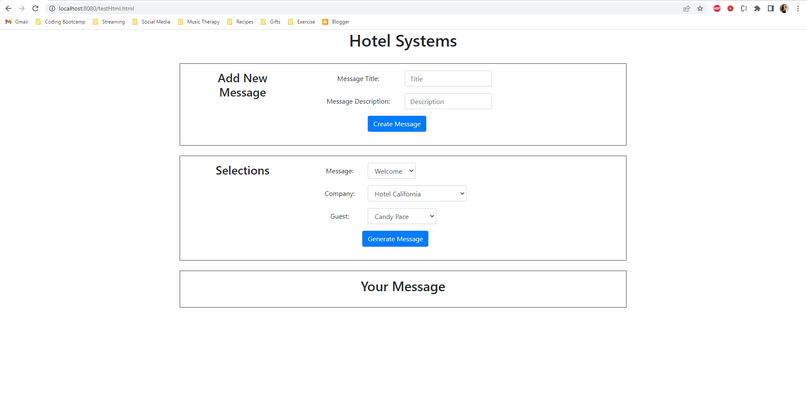
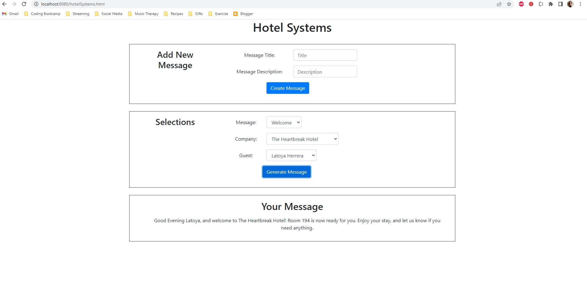
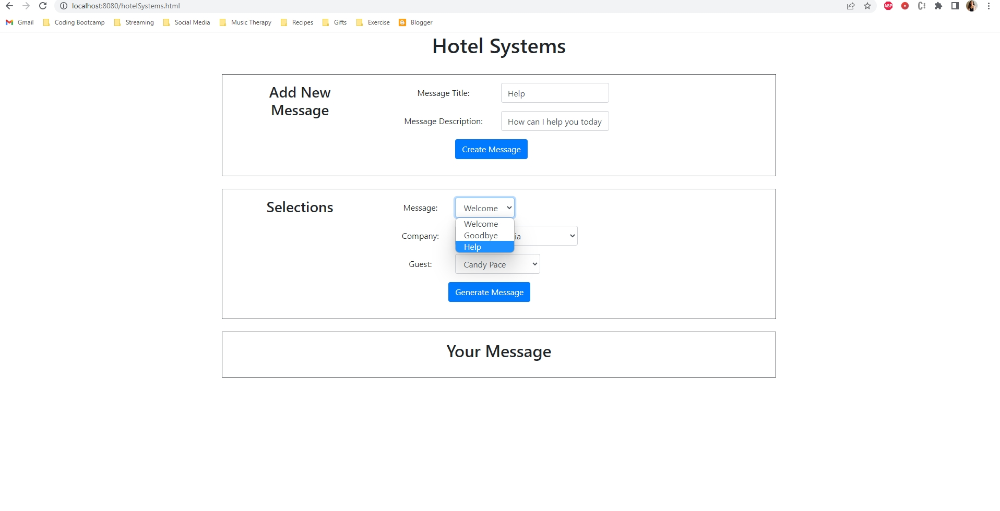
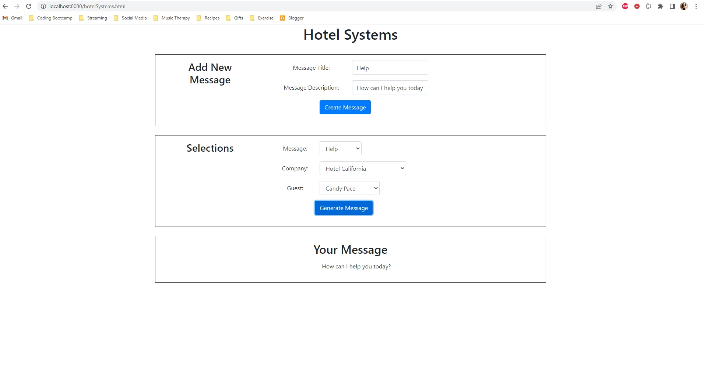

# Hotel Systems Project

<h3 align="center">Hotel Systems Project</h3>

    Project Description:
    Generate a message depending on selections made by user. User is able to create their own message and use it as template. 

    How To Run Program:
    Connect to a local server and open HTML page on web browser.
    -- For example, in my command prompt, I located the folder in which HTML file is located, then in the command prompt entered 'http-server' to connect to my localhost:8080
    -- Then I used the chrome web browser and entered localhost:8080 and navigated to the hotelSystems.html to view the page or entered localhost:8080/hotelSystems.html
    

    Various images of project.

    Generated Message Example
    

    Creating New Message and Output
    
    

    Design Decisions:
    I chose to design the project using HTML and JavaScript because it appeared to be the simplest approach with the amount of time given. I knew I would be able to
    deliver a working project if done this way. If given more time, I would write the program using Java langage and in NetBeans IDE as that is what I'm most familar with.

    Correctness of Program:
    If given more time, I would've included validations and checked for errors. I would've included code or function to replace placeholders appropriately when user
    creates a new message. If given more time, I would've made the HTML page look much cleaner and more desirable from a user's perspective.

